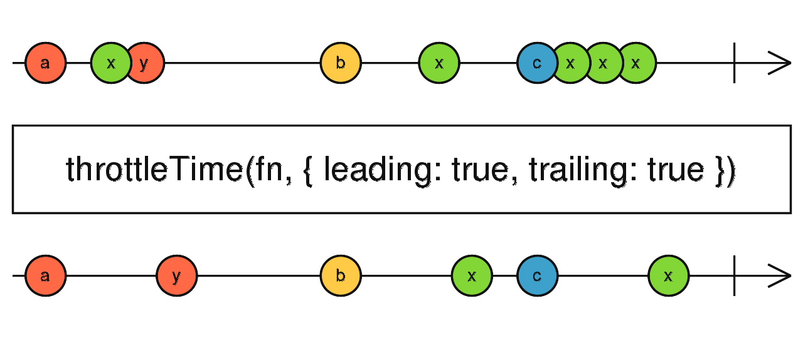
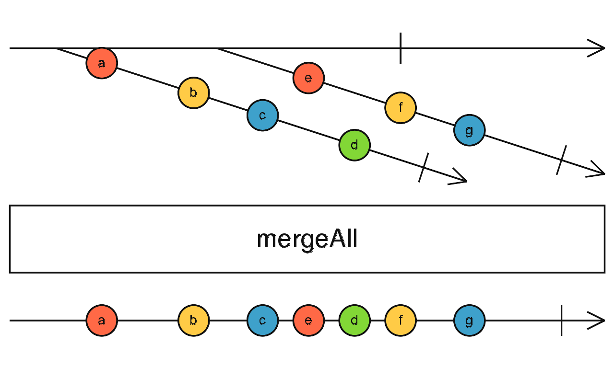

# Introduction

_"Reactive programming is declarative programming paradigm concerned with data streams and the propagation of change."_

- Wikipedia

---

Front-end development has changed after introduction of Single Page Application and brought more state management with 
it, in this world of state, events are everywhere and this is where reactive programming comes.
    
Reactive programming as in it's named is focused on reactivity, on events and reacting to them, be it a button click,
an interval clock ticking, HTTP request, multiple event source streams merge or backpressure handling.  

---

### Small example comparison

Standard approach
```javascript
let count = 0
const rate = 1000
let lastClick = Date.now() - rate
const button = document.querySelector('button')
button.addEventListener('click', () => {
    if (Date.now() - lastClick >= rate) {
        console.log(`Clicked ${++count} times`)
    }
    lastClick = Date.now()
})
```

With RxJS

```javascript
const button = document.querySelector('button')
const clicks$ = Rx.Observable.fromEvent(button, 'click').pipe(
        throttleTime(1000),
        scan(count => count + 1, 0)
    );
    
clicks$.subscribe(count => {
    console.log(`Clicked ${count} times`)
})
```

---

### Example of stream operators

Throttle time operator



Filter operator


Merge all operator



Debounce operator


---

## Under the hood

To better understand and get started with reactive programming, it's important to know what's the underlying
implementation. Reactive programming in its core is just the observer pattern.


---

## Getting our hands dirty

The best way to learn is getting our hands dirty, so for that lets try the following exercises:

1. Create observer for propagating events
2. Create an input field in HTML that will write to 3 paragraphs as the user types and stop writing to the second
   paragraph if the user inputs "stop".
3. Create operators for filtering and mapping of our custom observable stream data

---

## Hot and cold observables

- **Cold** observables are lazy, meaning that they start executing only when someone subscribes. Here you can see that
  each subscription got a different value because each of them triggered the pipeline.
  ```javascript
    import * as Rx from "rxjs";
   
    const observable = Rx.Observable.create((observer) => {
        observer.next(Math.random()); // 0.42455144742250234 (random number)
    });
   
    // subscription 1
    observable.subscribe((data) => {
        console.log(data);
    });
   
    // subscription 2
    observable.subscribe((data) => {
        console.log(data); // 0.107657240548045671 (random number)
    });
  ```
- **Hot** observables are observables where the logic is triggered before subscribing, for example the `click` event is
  being emitted without having to subscribe.
   ```javascript
   import * as Rx from "rxjs";
   
   const observable = Rx.Observable.fromEvent(document, 'click');
   
   // subscription 1
   observable.subscribe((event) => {
     console.log(event.clientX);
   });
   
   // subscription 2
   observable.subscribe((event) => {
      console.log(event.clientY);
   });
   ```
