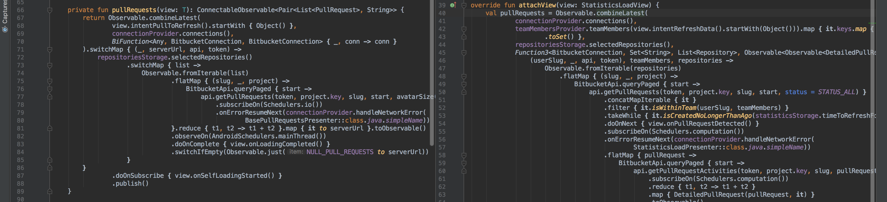

# Reactive servers

Luckily, Spring boot has great support for reactive programming with Project Reactor. Spring has great documentation 
and support for creating either an HTTP API or Websocket server with reactive streams.

---

## Reactive databases

Working with databases is a bit different, we were used soo much working with standard blocking calls, that most of 
the libraries are blocking like SQL databases, while some are not like MongoDB. But, there is a solution that's nearing
stable release that aims to redo the database driver and bring them into the reactive world, that project is called
[R2DBC](https://r2dbc.io/).

---

## Preventing reactor meltdown

---

## RSocket protocol

---

## Reactive paradigm might not be always simple
Sometimes we can have certain cases that can be quite complex to manage...

## Summary

Reactive programming as any tool has its pros and cons, and it's up to you to decide when and how to use it.

Pros
 - Simplicity
 - Robust toolset 
 - High concurrency and resilience with backpressure
 - Event driven plays nicely

Cons
 - Unclear streams when things get complex
 - Complete programming mind-shift
 - Complexity when trying to do blocking tasks and synchronization
 - Steep learning curve
